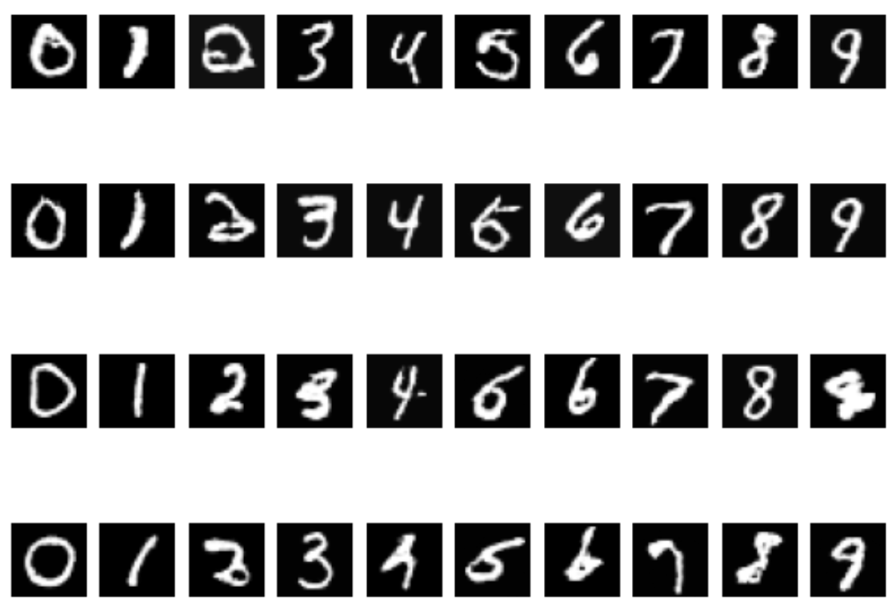

# gan_sketchapad
Sketchpad repository for simple GAN implementations trained on MNIST model

### Sample images generated with conditional GAN

### References
GAN models used in this project are largery based on
- https://machinelearningmastery.com/how-to-develop-a-generative-adversarial-network-for-an-mnist-handwritten-digits-from-scratch-in-keras/
- https://github.com/Zackory/Keras-MNIST-GAN/blob/master/mnist_gan.py
- https://github.com/keras-team/keras-io/blob/master/examples/generative/conditional_gan.py

### Setting up environment

Minimal host-side python environment is needed to run helper commands.
You can install one using `conda` and provided `conda.yaml` environment definition, but any python 3.x version with [invoke](https://www.pyinvoke.org/) installed should work as well.

Docker container is provided for running the core code.
You can build the container with `invoke docker.build-app-container` and run it with `invoke docker.run`.

### Running the code
You can use `invoke --list` to see list of available commands, and `invoke --help {{ command }}` to see help for that command.

Here's a list of some of the more important commands:
- `tests.commit-stage` - runs test cases and static code analysis, use to check that your environment is setup correctly
- `train.train-mnist-gan` - trains a simple, unconditional GAN model on mnist dataset. Logs results to log file indicated by input configuration file
- `train.train-keras-mnist-conditional-gan` - trains a conditional GAN model on mnist dataset. Logs results to log file indicated by input configuration file
